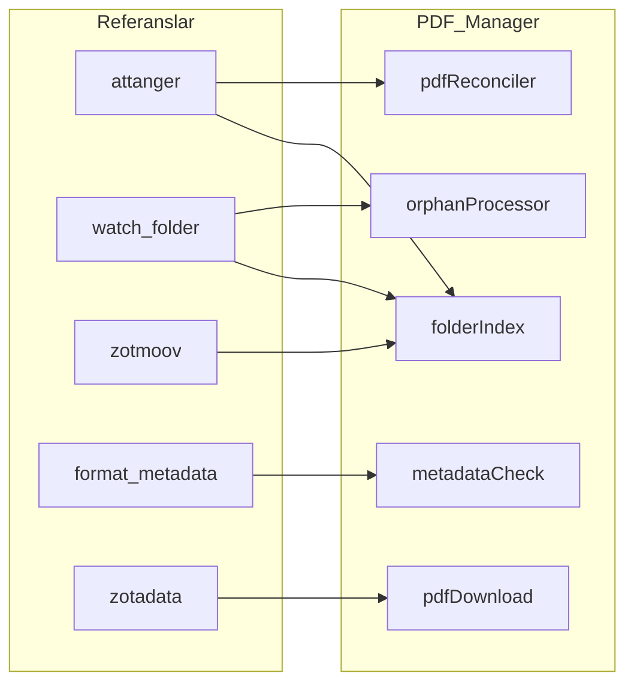

<!-- @ajan: cursor · @etiket: katman-2, referans-port, b5-zoplicate -->

# Zotero PDF Manager — referans eklenti entegrasyon planı

**Bu belge:** `../referanslar/` altındaki üçüncü parti eklentilerden **Katman 2** PDF Manager’a
kod taşıma — lisans, yasaklar, hangi upstream’in nereye gideceği.

**Kuratör kök (2026-08):** `../referanslar/katman-2/` — kategori klasörleri:
`ek-dosya`, `metadata-linter`, `yinelenen`, `ek-silme`, `cnki-metadata`.

Otomasyon fazları (**P2-1…P2-6**): [`AUTOMATION_PLAN.md`](AUTOMATION_PLAN.md) · Katman özeti:
[`KATMAN-2-PLAN.md`](KATMAN-2-PLAN.md) · Fiili vendor tablo: [`PDFMANAGER-VENDOR.md`](PDFMANAGER-VENDOR.md)

LibRart (Katman 3) port planı **değil** → `../kaynak/LIBRART-REFERANS-PORT.md`.

---

## 1. Kapsam

- Referans kökü: `zotero-eklentiler/referanslar/<klasör>/`
- Hedef: `zotero-pdf-manager/src/modules/`, gerekirse `src/vendor/<ref-name>/`
- PDF Manager lisansı: **AGPL-3.0-or-later** — birleşik eser AGPL kalır
- **Tam ürün kopyası yok** (özellikle watch-folder Mode 2/3 aynalama — varsayılan kapalı, opt-in)

---

## 2. Lisans — dört kural

1. **Lisanssız → kod portu YOK** (yalnız mimari inceleme veya temiz oda)
2. **MIT / GPL / AGPL → port serbest**; attribution zorunlu (`THIRD_PARTY_NOTICES.md` + dosya başı)
3. **Kullanıcı onayı telif izni değildir**
4. **Katman sınırı:**
   - OCR (`zotero-ocr`) → **Katman 1** — Katman 2’ye taşınmaz
   - Harita / atıf grafiği → **Katman 3** (LibRart)
   - Sci-Hub (`zotero-scipdf`) → varsayılan OA şelalesine **gömülmez** (opt-in/manuel)

### Port yöntemleri

| Yöntem             | Anlam                                         |
| ------------------ | --------------------------------------------- |
| **selective port** | AGPL/GPL uyumlu seçici kod + attribution      |
| **safe vendor**    | `src/vendor/` altına dosya; provenance satırı |
| **behavior-only**  | Temiz oda / UX fikri; satır satır kopya yok   |
| **forbidden**      | Katman veya yasal yasak                       |

---

## 3. Port karar matrisi

| Öncelik | Referans                                          | Lisans                                      | Hedef modül                                             | Yöntem                                           |
| ------- | ------------------------------------------------- | ------------------------------------------- | ------------------------------------------------------- | ------------------------------------------------ |
| **P0**  | `zotero-attanger`                                 | AGPL-3.0-or-later                           | `pdfReconciler`, eşik/debounce, match                   | selective port                                   |
| **P1**  | `katman-1/klasor-izleme` (watch-folder)           | GPL-3.0-only                                | `folderIndex` polling, `orphanProcessor` inbox          | selective (mtime/kuyruk; canlı FS watcher değil) |
| **P1**  | `katman-2/ek-dosya/zotmoov`                       | GPL-3.0                                     | linked-file / base-dir disiplini                        | selective / behavior                             |
| **P1**  | `katman-2/ek-silme/delitemwithatt`                | GPL-3.0                                     | `attachmentDelete` linked unlink                        | selective / behavior ✅ v1.0.47                  |
| **P2**  | `katman-2/metadata-linter/zotero-format-metadata` | AGPL                                        | `metadataCheck` kuralları                               | selective                                        |
| **P2**  | `zotero-zotadata`                                 | LICENSE=MIT / pkg=AGPL → **AGPL gibi işle** | `pdfDownload` OA şelale                                 | selective (Sci-Hub hariç)                        |
| **B5**  | `katman-2/yinelenen/zoplicate`                    | AGPL                                        | **yan XPI** (merge); PDF Manager ince DOI/ISBN/KP rapor | companion + thin report (no merge port)          |
| **P3**  | `zotero-arxiv-workflow`                           | AGPL                                        | preprint↔yayın merge                                    | selective / behavior                             |
| Skip    | `katman-2/cnki-metadata/jasminum`                 | —                                           | —                                                       | CNKI; TR arşiv önceliği düşük                    |
| Skip    | `zotero-file`                                     | AGPL                                        | —                                                       | behavior-only (Attanger tercih)                  |
| Skip    | `zotero-scipdf`                                   | AGPL                                        | —                                                       | behavior-only opt-in                             |
| Yasak   | OCR (`katman-1/ocr`)                              | AGPL                                        | —                                                       | **Katman 1 sınırı**                              |

Mevcut notices: `zotero-attachment-scanner` (MIT) → [`THIRD_PARTY_NOTICES.md`](THIRD_PARTY_NOTICES.md).

---

## 4. Modül → referans

| PDF Manager modülü          | Durum        | Birincil referans                                         |
| --------------------------- | ------------ | --------------------------------------------------------- |
| `folderIndex`               | ✅ P2-1      | watch-folder + attanger + zotmoov (base-dir)              |
| `pdfReconciler`             | ✅ P2-2/P2-3 | **attanger** eşik + settle + drain coalesce               |
| `orphanProcessor`           | ✅ P2-5      | watch-folder (orphanMode + gated autoCreate)              |
| `attachmentScanner`         | ✅           | attachment-scanner (MIT, notices)                         |
| `metadataCheck`             | ✅ selective | format-metadata                                           |
| `pdfDownload`               | ✅ P2-4      | zotadata (OA only → downloads/)                           |
| `attachmentDelete`          | ✅ B1        | delitemwithatt (linked unlink + trash)                    |
| `duplicateAttachmentMerger` | ✅ PDF-att   | annotation-safe PDF merge (öğe merge = Zoplicate yan XPI) |
| `automationAudit`           | ✅ P2-6      | mevcut + filtre/özet/dry-run + geri alınabilir etiketler  |
| `pdfContentMetadata`        | ✅           | pdf-lib + Crossref; menüde manuel                         |
| `metadataNormalize`         | ✅ B4a–c     | format-metadata selective                                 |
| `duplicateItemReport`       | ✅ B5        | DOI/ISBN/KP aday; Zoplicate companion                     |

---

## 5. Faz tablosu (P2-1…P2-6) + kabul

| Faz      | İş                     | Birincil referans       | Somut çıktı                                                               | Kabul                                                |
| -------- | ---------------------- | ----------------------- | ------------------------------------------------------------------------- | ---------------------------------------------------- |
| **P2-1** | İndeks tamamlama       | watch-folder + attanger | `IndexedFile` + doi/isbn/pdfTitle; `pdf.useLinkedAttachmentBase`; testler | Çok-kök + linked-base birleşik indeks; mtime artımlı |
| **P2-2** | Reconcile eşikleri     | attanger                | Pref: `autoAttachThreshold` / `reviewThreshold`                           | Yüksek güven otomatik; belirsiz `#pdf-review`        |
| **P2-3** | add notifier ince ayar | attanger                | Settle delay / coalescing                                                 | Tek satır ek → tek reconcile                         |
| **P2-4** | OA → `downloads/`      | zotadata (OA)           | İndirilen watch-root altına + indekse                                     | Sci-Hub varsayılan kapalı                            |
| **P2-5** | orphan autoCreate      | watch-folder            | Periyodik yolda `orphanMode` saygısı                                      | `report` güvenli varsayılan                          |
| **P2-6** | Denetim UI             | audit + attanger UX     | Rapor parlatma / dry-run                                                  | Geri alınabilir etiketler                            |

**Eski LibRart F6 (Gelen Kutusu)** = bu fazların (özellikle P2-1/P2-5) karşılığı — LibRart’ta yok.

---

## 6. Vendor klasör + attribution checklist

Her port sonrası:

- [ ] Dosya başı: kaynak repo + lisans + `@ajan`
- [ ] [`PDFMANAGER-VENDOR.md`](PDFMANAGER-VENDOR.md) satırı
- [ ] [`THIRD_PARTY_NOTICES.md`](THIRD_PARTY_NOTICES.md) güncelle (MIT/GPL metin özeti)
- [ ] Kök `Changes.md` — `Ajan`, `Cursor`, `Dosyalar`
- [ ] `npm test` yeşil

Seçici port yolu: `src/vendor/<ref-name>/` **veya** mevcut modüle attribution yorumu.

---

## 7. Sonraki adım

**Tamamlandı (P2-1):** `folderIndex` — doi/isbn/pdfTitle, linked-base; v1.0.22.

**Tamamlandı (P2-2):** `autoAttachThreshold` / `reviewThreshold` / `addSettleMs`;
orta güven → `#pdf-review`; v1.0.23.

**Tamamlandı (P2-3):** add notifier drain/coalesce, attachment→parent,
trash/delete iptal, autoOnAdd rebind; v1.0.24.

**Tamamlandı (P2-4):** OA → `{watchRoot}/downloads/` + indeks kaydı;
`pdf.saveOaToDownloads`; Sci-Hub otomatik yok; v1.0.25.

**Tamamlandı (P2-5):** `orphanMode` periyodik saygı; opt-in `autoCreate` +
DOI/ISBN/tez kapısı; manuel düğme serbest; v1.0.26.

**Tamamlandı (P2-6):** denetim raporu filtre/özet/dry-run banner; geri alınabilir
etiket listesi; clear audit; manuel dry-run sonrası audit açılır; v1.0.27.

**Katman 2 otomasyon P2-1…P2-6 + B1–B5 tamam (v1.0.49).** Sonraki: G1 YÖKTez
auto politikası · G2 manuel kabul checklist v1.0.49 · isteğe bağlı P3 lint.
